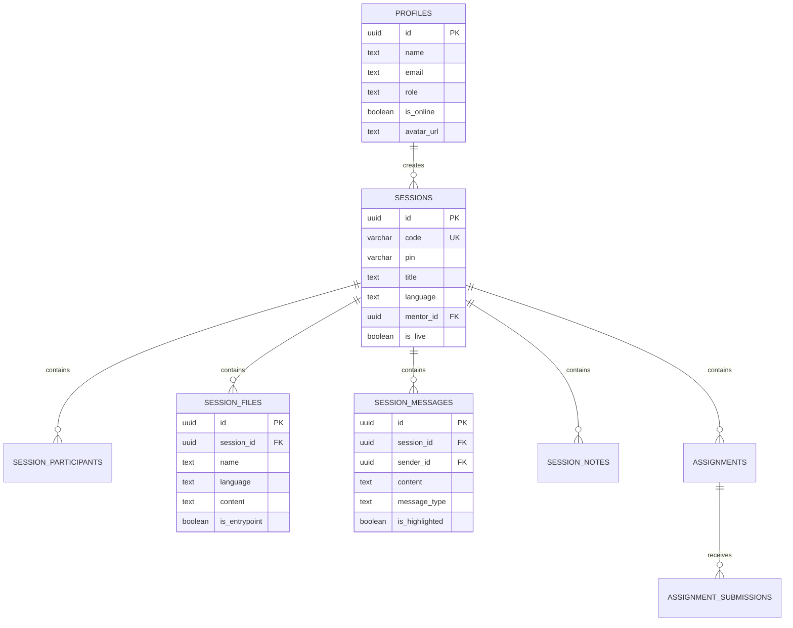

# CodeBuddy — Architecture, System Design & File Documentation

> **Mission**: A modern, real-time 1-on-1 collaborative code teaching and mentoring platform where mentors teach HTML, C Language, and JavaScript to their friends live with an interactive 1-second delayed smooth typewriter synchronization, real-time Q&A, coding assignments, and room PIN security. Built and evaluated against the **Universal Design Laws**.

---

## 1. Core Engineering Rules & Constraints

1. **Strict File Size Cap**: **Every single file MUST stay under 500 Lines of Code (< 500 LOC)** without exception (currently all files are < 330 LOC).
2. **Maximum Reusability & Modularity**: Components, hooks, utilities, and stores are modular, isolated, and reusable across both the Mentor and Learner interfaces.
3. **Workspace Isolation**: Clean language-specific workspace environments (`html` has `index.html`, `style.css`, `script.js`; `c` has `main.c`, `helper.h`, `README.md`; `javascript` has `index.js`, `utils.js`).
4. **Real Multi-File Web Linking**: `SessionLivePreview.tsx` automatically bundles and injects `style.css` and `script.js` into `index.html` on the fly so edits to CSS/JS immediately affect the live DOM output.
5. **Universal Design Laws Compliance**: Every view adheres to cognitive psychology (Jakob's, Fitts's, Hick's, Miller's, Doherty, Peak-End), Gestalt perception, Norman's interaction principles, Nielsen heuristics, and POUR accessibility.

---

## 2. Tech Stack

| Layer | Technology | Purpose |
| :--- | :--- | :--- |
| **Framework** | **React 19 + TypeScript** | Strict type safety, component composition, and performance |
| **Styling** | **Tailwind CSS v4** | Modern CSS token engine with dynamic accent variables (`data-accent`, `data-theme`) |
| **Animations** | **Framer Motion** | Smooth modal transitions, sidebar collapse animations, and typewriter effects |
| **Icons** | **Lucide React** | Clean, unified SVG icon set |
| **State Management** | **Zustand** | Lightweight, reactive global stores for session, code, settings, and UI |
| **Server State** | **TanStack Query v5** | Caching, async queries, and optimistic updates |
| **Syntax Highlighting** | **Shiki** | High-fidelity TextMate syntax highlighting for HTML, C, and JavaScript |
| **Execution Engine** | **Custom C Interpreter** | Client-side C parser, variable evaluator, printf formatting & GCC terminal |
| **Pro Code Editor Suite** | **Multi-File Linking, Tabs & ⌘K** | Multi-file workspace tabs, language isolation, formatting, status bar, and command palette |
| **Realtime Backend** | **Supabase JS + PostgreSQL** | Presence tracking, Broadcast channels, PostgreSQL DB, and RLS |
| **Build Tool** | **Vite 6** | Ultra-fast HMR and optimized bundler |

---

## 3. Database Schema (Supabase PostgreSQL)

Located at: [`supabase/schema.sql`](file:///D:/do%20note%20delete/Desktop/LiveClass/supabase/schema.sql)



---

## 4. Complete Folder & File Directory Map

```
LiveClass/
├── .env                                # Supabase credentials & app configs
├── .env.example                        # Template environment variables
├── .gitignore                          # Git ignore rules
├── index.html                          # Root HTML with Google Fonts
├── package.json                        # Dependencies & scripts
├── tsconfig.json                       # TS root configuration
├── tsconfig.app.json                   # TS client compiler options
├── tsconfig.node.json                  # TS node compiler options
├── vite.config.ts                      # Vite bundler configuration with Tailwind v4 & path alias
├── supabase/
│   └── schema.sql                      # Production PostgreSQL schema, tables, RLS & Realtime publications (< 180 LOC)
├── public/
│   └── logo.svg                        # Brand logo SVG
└── src/
    ├── main.tsx                        # React 19 app entrypoint (< 15 LOC)
    ├── app/
    │   ├── App.tsx                     # Root App shell & dynamic multi-page router (< 65 LOC)
    │   ├── HomePage.tsx                # Home Page layout matching design screenshot (< 55 LOC)
    │   ├── SessionWorkspace.tsx        # Live Classroom Workspace orchestrator (< 50 LOC)
    │   ├── LanguagesPage.tsx           # Multi-language curriculum & progress dashboard (< 315 LOC)
    │   ├── MyNotesPage.tsx             # Notes reader, search, filter & editor orchestrator (< 285 LOC)
    │   ├── SettingsPage.tsx            # Full preferences & theme management page (< 190 LOC)
    │   └── UnderDevelopmentPage.tsx    # Reusable feature development roadmap illustration page (< 140 LOC)
    ├── styles/
    │   └── index.css                   # Tailwind v4 import, custom scrollbars, dynamic accent tokens (< 140 LOC)
    ├── types/
    │   ├── session.types.ts            # Session, Room, User, Language interfaces (< 35 LOC)
    │   ├── code.types.ts               # Code file, streaming payload, assignment interfaces (< 45 LOC)
    │   ├── question.types.ts           # Realtime Q&A interfaces (< 15 LOC)
    │   └── stats.types.ts              # UI stat metrics interfaces (< 20 LOC)
    ├── lib/
    │   ├── utils.ts                    # Class merger (cn), room code/PIN generators, formatters (< 50 LOC)
    │   ├── cInterpreter.ts             # Interactive C language parser, variables, loops & GCC terminal (< 230 LOC)
    │   ├── supabase.ts                 # Supabase client initializer with graceful fallback (< 25 LOC)
    │   └── shiki.ts                    # Shiki syntax highlighter with theme and language caches (< 40 LOC)
    ├── services/
    │   └── sessionService.ts           # Supabase REST & Realtime API integration with fallback (< 145 LOC)
    ├── stores/
    │   ├── sessionStore.ts             # Session state, active session, room creation & PIN actions (< 115 LOC)
    │   ├── codeStore.ts                # Multi-file isolated templates, linking snapshot, history (< 330 LOC)
    │   ├── questionStore.ts            # Live Q&A state, unread alerts, mentor replies (< 100 LOC)
    │   ├── settingsStore.ts            # All 9 settings modules, theme & accent DOM synchronizer (< 195 LOC)
    │   └── uiStore.ts                  # Sidebar collapse, modals, active tabs, and toast alerts (< 85 LOC)
    ├── hooks/
    │   ├── useDelayedTypewriter.ts     # 1-second delayed smooth typewriter animation engine (< 85 LOC)
    │   ├── useClipboard.ts             # Async clipboard copy with automatic toast feedback (< 35 LOC)
    │   └── useRealtimeSession.ts       # Supabase Realtime broadcast & presence subscription (< 85 LOC)
    └── components/
        ├── common/
        │   ├── Badge.tsx               # Reusable status pill badge with pulsing live dot (< 45 LOC)
        │   ├── Button.tsx              # Reusable button with dynamic accent classes (< 65 LOC)
        │   ├── Card.tsx                # Reusable rounded card container (< 30 LOC)
        │   ├── Avatar.tsx              # User avatar with online indicator and initials fallback (< 70 LOC)
        │   ├── Modal.tsx               # Animated accessible dialog modal using Framer Motion (< 90 LOC)
        │   └── ToastContainer.tsx      # Floating toast notifications container (< 50 LOC)
        ├── layout/
        │   ├── Sidebar.tsx             # Collapsible sidebar (desktop icon-only bar + mobile drawer) (< 240 LOC)
        │   ├── Header.tsx              # Responsive top header with hamburger menu & '+ New Session' (< 70 LOC)
        │   └── AppLayout.tsx           # Global flex layout wrapper (< 30 LOC)
        ├── code/
        │   ├── ShikiHighlighter.tsx    # Syntax highlighted code renderer with line numbers (< 85 LOC)
        │   ├── LivePreviewFrame.tsx    # Sandboxed live DOM iframe preview with address bar (< 100 LOC)
        │   └── MockEditorPreview.tsx   # Responsive dual Editor & Live Preview banner widget (< 120 LOC)
        ├── home/
        │   ├── HeroBanner.tsx          # Responsive live teaching banner with CTA & 'How it works' modal (< 120 LOC)
        │   ├── LanguageCard.tsx        # Reusable language selection card (HTML, C, JavaScript) (< 65 LOC)
        │   ├── LanguageSection.tsx     # Grid container for the 3 language cards (< 65 LOC)
        │   ├── ActiveSessionCard.tsx   # Right column active session widget with link to classroom (< 100 LOC)
        │   ├── RecentQuestionsCard.tsx # Right column recent questions widget with interactive reply modal (< 150 LOC)
        │   ├── StatsRow.tsx            # Bottom 4-metric statistics row (Sessions, Time, Q&A, Learners) (< 75 LOC)
        │   ├── ProTipCard.tsx          # Bottom right Pro Tip card with bookmarks advice (< 45 LOC)
        │   ├── NewSessionModal.tsx     # Modal to create room, select language, view PIN & copy URL (< 200 LOC)
        │   └── JoinSessionModal.tsx    # Modal to connect to an existing room with Code & PIN (< 110 LOC)
        ├── session/
        │   ├── SessionHeader.tsx       # Live room title, live badge, invite, copy link, and end session (< 150 LOC)
        │   ├── EditorToolbar.tsx       # 44px tap targets, 'Run Code', Auto-Run toggle, history toggle (< 140 LOC)
        │   ├── EditorBreadcrumbs.tsx   # Path breadcrumbs, branch indicator, live collaborators (< 60 LOC)
        │   ├── EditorFileTabs.tsx      # Clean language-isolated multi-file tabs (< 95 LOC)
        │   ├── EditorMinimap.tsx       # Code minimap with live viewport scrubber (< 55 LOC)
        │   ├── EditorStatusBarPro.tsx  # 3-cluster pro status bar with formatting & latency (< 85 LOC)
        │   ├── CodeTimelineSlider.tsx  # Interactive keystroke history playback scrubber (< 85 LOC)
        │   ├── CommandPaletteModal.tsx # Global ⌘K / Ctrl+K interactive command palette (< 225 LOC)
        │   ├── InteractiveCodeEditor.tsx # Clean, decluttered live editor orchestrator (< 240 LOC)
        │   ├── SessionLivePreview.tsx  # Multi-file linked DOM preview & GCC terminal (< 180 LOC)
        │   ├── SessionChatPanel.tsx    # Tabbed live Chat with Amit's messages & highlighted mentor replies (< 225 LOC)
        │   └── SessionSidebar.tsx      # Participants card, session info with running timer, quick actions (< 220 LOC)
        ├── notes/
        │   ├── NoteListSidebar.tsx     # All Notes list sidebar with badges & pin status (< 110 LOC)
        │   ├── NoteContentViewer.tsx   # Center formatted markdown note reader with Shiki snippet (< 100 LOC)
        │   ├── NoteDetailsSidebar.tsx  # Note metadata (words, chars, tags) & PDF export (< 100 LOC)
        │   └── NoteEditorModal.tsx     # Interactive Note Editor modal for creating & editing notes (< 100 LOC)
        └── settings/
            ├── GeneralSettingsSection.tsx       # Default language, session mode & auto-save settings (< 75 LOC)
            ├── AccountSettingsSection.tsx       # Avatar picker, name, email, bio & password manager (< 165 LOC)
            ├── AppearanceSettingsSection.tsx    # Theme Light/Dark, 5 dynamic accent color tokens (< 135 LOC)
            ├── EditorSettingsSection.tsx        # Tab size, word wrap, line numbers & bracket closing (< 130 LOC)
            ├── NotificationsSettingsSection.tsx # Audio alerts, join chimes & daily email digest (< 95 LOC)
            ├── ChatSettingsSection.tsx          # Live typing indicators, auto-scroll, upvotes (< 95 LOC)
            ├── PrivacySettingsSection.tsx       # Room PIN enforcement, public directory, incognito (< 95 LOC)
            ├── StorageSettingsSection.tsx       # 2.4 GB / 10 GB breakdown, cache clear, JSON export (< 145 LOC)
            ├── AdvancedSettingsSection.tsx      # Supabase key tester, GCC engine mode & factory reset (< 145 LOC)
            └── SettingsRightSidebar.tsx         # Profile card, quick settings, storage progress & help (< 145 LOC)
```
